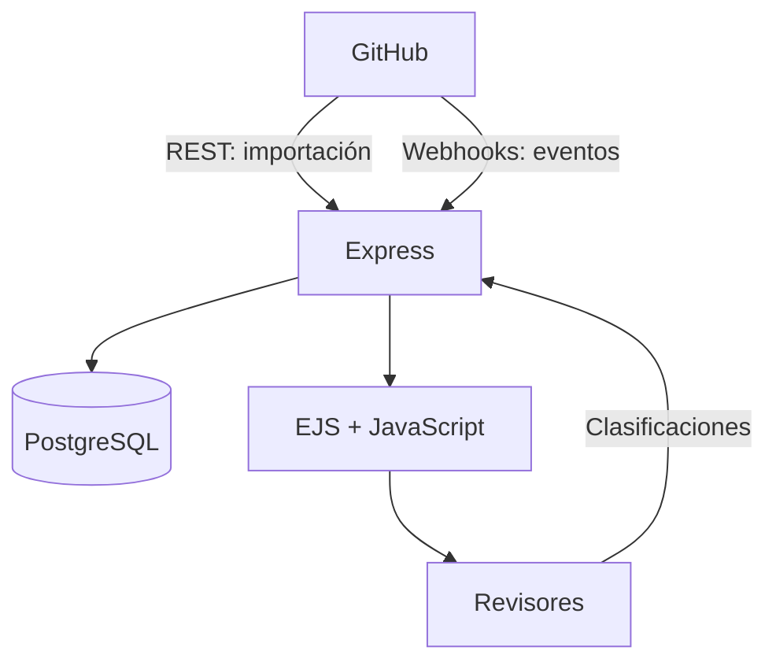

# Especificación técnica: clasificación de retrabajo en Pull Requests mediante card sorting

**Estado:** Borrador para refinamiento  
**Versión:** 0.1.0  
**Fecha:** 2026-08-17  
**Stack base propuesto:** Node.js, Express, EJS, PostgreSQL, GitHub App, GitHub REST API y webhooks

## 1. Resumen

El sistema permitirá importar Pull Requests (PR) desde GitHub, presentar cada PR como una tarjeta y permitir que múltiples revisores clasifiquen, de manera independiente, los motivos del retrabajo requerido después de la creación del PR.

GitHub será la fuente de los datos técnicos del PR. La aplicación mantendrá en su propia base de datos las sesiones de card sorting, categorías, clasificaciones, justificaciones, métricas derivadas y resultados de concordancia entre revisores.

## 2. Problema

La información relevante para identificar retrabajo se encuentra distribuida entre la descripción del PR, commits, archivos modificados, revisiones, comentarios y eventos ocurridos durante su ciclo de vida. La interfaz estándar de GitHub no está diseñada para ejecutar card sorting independiente con varios revisores ni para conservar taxonomías versionadas y resultados experimentales.

El sistema debe:

1. Reunir la evidencia relevante de cada PR.
2. Reconstruir, dentro de las limitaciones de la API, su evolución posterior a la creación.
3. Presentar PR comparables como tarjetas.
4. Evitar que un revisor influya en otro durante la clasificación.
5. Conservar resultados individuales y calcular resultados agregados.

## 3. Objetivos

### 3.1 Objetivo general

Construir una aplicación web que permita aplicar card sorting a Pull Requests para identificar y analizar motivos de retrabajo posterior a su creación.

### 3.2 Objetivos específicos

- Integrar uno o más repositorios de GitHub.
- Importar PR históricos y mantener sincronizados los PR nuevos o modificados.
- Presentar una ficha normalizada por PR.
- Permitir card sorting abierto, cerrado o híbrido.
- Mantener sesiones y respuestas independientes por revisor.
- Registrar categoría, justificación, confianza y evidencia considerada.
- Calcular acuerdo entre revisores y detectar PR sin consenso.
- Exportar los datos para análisis posterior.

## 4. Alcance

### 4.1 Incluido en el MVP

- Autenticación de usuarios del sistema.
- Roles `ADMIN`, `RESEARCHER` y `REVIEWER`.
- Integración con repositorios mediante GitHub App.
- Importación de PR y datos asociados mediante REST API.
- Recepción y validación de webhooks de GitHub.
- Creación y versionado de estudios y taxonomías.
- Creación de sesiones individuales de clasificación.
- Tablero card sorting con arrastrar y soltar.
- Clasificación única o múltiple, configurable por estudio.
- Justificación y nivel de confianza por clasificación.
- Panel de progreso y resultados agregados.
- Exportación CSV o TSV anonimizada.
- Registro básico de auditoría.

### 4.2 Fuera del MVP

- Edición, aprobación o fusión de PR desde la aplicación.
- Publicación automática de resultados en GitHub.
- Replicación exacta de la interfaz de GitHub.
- Clasificación automática mediante IA.
- Análisis semántico automático de código o comentarios.
- Colaboración simultánea en una misma sesión.

## 5. Actores y permisos

| Actor | Responsabilidades |
|---|---|
| Administrador | Gestionar usuarios, repositorios, integración y configuración global. |
| Investigador | Crear estudios, definir taxonomías, seleccionar PR y consultar/exportar resultados. |
| Revisor | Clasificar las tarjetas asignadas y completar sus sesiones. |
| GitHub | Proporcionar datos y notificar eventos mediante webhooks. |

### 5.1 Reglas de acceso

- Un revisor solo puede acceder a estudios y PR asignados.
- Un revisor no puede ver clasificaciones ajenas antes de completar su sesión, salvo configuración explícita del estudio.
- Un investigador no debe modificar una taxonomía ya utilizada; debe crear una nueva versión.
- Los secretos y tokens de GitHub solo estarán disponibles en el servidor.

## 6. Decisiones de arquitectura

### 6.1 Arquitectura propuesta



### 6.2 Decisiones

| Área | Decisión inicial | Justificación |
|---|---|---|
| Integración | GitHub App | Permisos acotados, instalación por repositorio y webhooks. |
| Ingesta inicial | REST API | Implementación simple y endpoints directos para PR. |
| Optimización futura | GraphQL | Útil si una vista requiere demasiadas peticiones REST. |
| Persistencia | PostgreSQL | Integridad relacional, consultas analíticas y JSONB para eventos. |
| Backend | Express | Compatible con el entorno existente. |
| Renderizado | EJS | SSR simple y consistente con el proyecto existente. |
| Interacción | JavaScript progresivo + SortableJS o equivalente | Drag-and-drop sin convertir el proyecto en una SPA. |
| Actualización | Webhooks + reconciliación periódica | Tiempo cercano a real y recuperación ante eventos perdidos. |

## 7. Modalidades de card sorting

Cada estudio configurará una modalidad:

- **Abierto:** el revisor crea y nombra categorías.
- **Cerrado:** el investigador proporciona todas las categorías.
- **Híbrido:** existen categorías iniciales y el revisor puede crear otras.

Configuraciones adicionales:

- Una o varias categorías por PR.
- Categoría obligatoria u opcional.
- Justificación obligatoria u opcional.
- Escala de confianza, propuesta: 1 a 5.
- Orden aleatorio de tarjetas por sesión.
- Posibilidad de marcar `INDETERMINADO` o `EVIDENCIA_INSUFICIENTE`.
- Reapertura de sesiones solo por un investigador.

## 8. Información de una tarjeta

### 8.1 Resumen visible

- Repositorio y número del PR.
- Título.
- Estado: abierto, cerrado, fusionado o borrador.
- Autor seudonimizado o visible, según el estudio.
- Fechas de creación, primera revisión, aprobación, cierre y fusión.
- Cantidad de commits, archivos, adiciones y eliminaciones.
- Cantidad de revisiones y solicitudes de cambio.
- Indicadores derivados de retrabajo.

### 8.2 Detalle expandible

- Descripción del PR.
- Lista de commits con fecha y autor seudonimizable.
- Archivos modificados y estadísticas.
- Revisiones y estado de cada revisión.
- Comentarios generales.
- Comentarios sobre líneas del diff.
- Línea temporal normalizada.
- Enlace al PR original, si el protocolo del estudio lo permite.

### 8.3 Reducción de sesgo

El estudio debe permitir ocultar:

- Identidad del autor.
- Identidad de revisores de GitHub.
- Etiquetas del repositorio.
- Estado final o resultado de la fusión.
- Enlace al PR original.
- Categorías o decisiones de otros revisores.

## 9. Datos obtenidos desde GitHub

### 9.1 Endpoints REST previstos

```text
GET /repos/{owner}/{repo}/pulls
GET /repos/{owner}/{repo}/pulls/{number}
GET /repos/{owner}/{repo}/pulls/{number}/commits
GET /repos/{owner}/{repo}/pulls/{number}/files
GET /repos/{owner}/{repo}/pulls/{number}/reviews
GET /repos/{owner}/{repo}/pulls/{number}/comments
GET /repos/{owner}/{repo}/issues/{number}/comments
```

### 9.2 Webhooks previstos

- `pull_request`
- `pull_request_review`
- `pull_request_review_comment`
- `pull_request_review_thread`, si está disponible para la instalación
- `issue_comment`
- `push`, cuando sea necesario relacionar cambios de la rama del PR
- `installation`
- `installation_repositories`

### 9.3 Reglas de sincronización

1. Guardar el identificador de entrega de cada webhook y procesarlo de forma idempotente.
2. Validar la firma del webhook antes de procesar su contenido.
3. Responder rápidamente y procesar trabajos pesados en segundo plano.
4. Reintentar errores transitorios con retroceso exponencial.
5. Ejecutar una reconciliación programada para detectar eventos perdidos.
6. Guardar `last_synced_at`, estado y mensaje del último error por PR.
7. No sobrescribir clasificaciones humanas cuando se actualice un PR.

## 10. Definición operacional de retrabajo

**Borrador de definición:** cambio realizado después de la creación del PR que responde a una deficiencia detectada, una solicitud de revisión, un problema de integración o una necesidad de corregir o completar el trabajo originalmente propuesto.

Esta definición debe ser validada por el responsable metodológico antes de implementar cálculos definitivos.

### 10.1 Indicadores candidatos

- `post_creation_commit_count`
- `changes_requested_review_count`
- `review_comment_count`
- `issue_comment_count`
- `review_cycle_count`
- `time_to_first_review_minutes`
- `time_to_first_changes_requested_minutes`
- `time_to_approval_minutes`
- `time_to_merge_minutes`
- `commits_after_first_review_count`
- `commits_after_changes_requested_count`
- `files_changed_after_first_review_count`
- `lines_added_after_first_review`
- `lines_deleted_after_first_review`

### 10.2 Ciclo de retrabajo propuesto

Un ciclo comienza con una revisión `CHANGES_REQUESTED` y termina con la siguiente revisión concluyente, aprobación, cierre o fusión. Los commits realizados dentro del intervalo se atribuyen al ciclo como evidencia de retrabajo, sin asumir automáticamente causalidad.

### 10.3 Limitaciones históricas

- Los PR históricos pueden no permitir reconstruir cada versión exacta del diff.
- Las fechas permiten una reconstrucción parcial, no necesariamente causal.
- Debe distinguirse entre datos observados, métricas derivadas e inferencias.
- El protocolo debe registrar si un PR fue observado prospectiva o retrospectivamente.

## 11. Modelo de dominio

### 11.1 Entidades principales

```text
User
Repository
PullRequest
PullRequestSnapshot
PullRequestEvent
Study
Taxonomy
TaxonomyCategory
StudyPullRequest
ReviewerAssignment
SortingSession
Classification
ClassificationCategory
AuditLog
WebhookDelivery
```

### 11.2 Esquema lógico inicial

#### `users`

```text
id UUID PK
github_user_id BIGINT NULL UNIQUE
email VARCHAR UNIQUE
display_name VARCHAR
role ENUM(ADMIN, RESEARCHER, REVIEWER)
status ENUM(ACTIVE, DISABLED)
created_at TIMESTAMPTZ
updated_at TIMESTAMPTZ
```

#### `repositories`

```text
id UUID PK
github_repository_id BIGINT UNIQUE
installation_id BIGINT
owner VARCHAR
name VARCHAR
is_private BOOLEAN
sync_status VARCHAR
last_synced_at TIMESTAMPTZ NULL
created_at TIMESTAMPTZ
updated_at TIMESTAMPTZ
UNIQUE(owner, name)
```

#### `pull_requests`

```text
id UUID PK
repository_id UUID FK
github_pr_id BIGINT UNIQUE
number INTEGER
title TEXT
body TEXT NULL
author_login VARCHAR NULL
state ENUM(OPEN, CLOSED, MERGED)
is_draft BOOLEAN
created_at_github TIMESTAMPTZ
closed_at_github TIMESTAMPTZ NULL
merged_at_github TIMESTAMPTZ NULL
additions INTEGER
deletions INTEGER
changed_files INTEGER
head_sha VARCHAR
base_sha VARCHAR
html_url TEXT
last_synced_at TIMESTAMPTZ
raw_payload JSONB
UNIQUE(repository_id, number)
```

#### `pull_request_events`

```text
id UUID PK
pull_request_id UUID FK
github_event_id VARCHAR NULL
event_type VARCHAR
action VARCHAR NULL
actor_login VARCHAR NULL
occurred_at TIMESTAMPTZ
payload JSONB
created_at TIMESTAMPTZ
```

#### `studies`

```text
id UUID PK
name VARCHAR
description TEXT
sorting_mode ENUM(OPEN, CLOSED, HYBRID)
assignment_mode ENUM(SINGLE_CATEGORY, MULTIPLE_CATEGORY)
blind_review BOOLEAN
randomize_cards BOOLEAN
require_justification BOOLEAN
confidence_scale_max SMALLINT NULL
status ENUM(DRAFT, ACTIVE, CLOSED, ARCHIVED)
created_by UUID FK users
created_at TIMESTAMPTZ
updated_at TIMESTAMPTZ
```

#### `taxonomies`

```text
id UUID PK
study_id UUID FK
version INTEGER
status ENUM(DRAFT, FROZEN, RETIRED)
created_at TIMESTAMPTZ
UNIQUE(study_id, version)
```

#### `taxonomy_categories`

```text
id UUID PK
taxonomy_id UUID FK
parent_id UUID NULL FK taxonomy_categories
name VARCHAR
description TEXT NULL
display_order INTEGER
created_by_reviewer_id UUID NULL FK users
created_at TIMESTAMPTZ
UNIQUE(taxonomy_id, name)
```

#### `study_pull_requests`

```text
study_id UUID FK
pull_request_id UUID FK
display_metadata JSONB
included_at TIMESTAMPTZ
PRIMARY KEY(study_id, pull_request_id)
```

`display_metadata` conserva qué campos y valores fueron presentados durante el estudio, evitando que una actualización posterior de GitHub altere silenciosamente el estímulo experimental.

#### `reviewer_assignments`

```text
id UUID PK
study_id UUID FK
reviewer_id UUID FK users
assigned_at TIMESTAMPTZ
status ENUM(PENDING, IN_PROGRESS, COMPLETED, WITHDRAWN)
UNIQUE(study_id, reviewer_id)
```

#### `sorting_sessions`

```text
id UUID PK
assignment_id UUID FK
taxonomy_id UUID FK
status ENUM(NOT_STARTED, IN_PROGRESS, COMPLETED, LOCKED)
started_at TIMESTAMPTZ NULL
completed_at TIMESTAMPTZ NULL
last_activity_at TIMESTAMPTZ NULL
card_order JSONB
```

#### `classifications`

```text
id UUID PK
session_id UUID FK
pull_request_id UUID FK
confidence SMALLINT NULL
justification TEXT NULL
is_uncertain BOOLEAN
classified_at TIMESTAMPTZ
updated_at TIMESTAMPTZ
UNIQUE(session_id, pull_request_id)
```

#### `classification_categories`

```text
classification_id UUID FK
category_id UUID FK
is_primary BOOLEAN
PRIMARY KEY(classification_id, category_id)
```

#### `webhook_deliveries`

```text
id UUID PK
github_delivery_id VARCHAR UNIQUE
event_type VARCHAR
signature_valid BOOLEAN
status ENUM(RECEIVED, PROCESSING, PROCESSED, FAILED, IGNORED)
attempt_count INTEGER
payload JSONB
received_at TIMESTAMPTZ
processed_at TIMESTAMPTZ NULL
error_message TEXT NULL
```

## 12. Flujos funcionales

### 12.1 Configuración del repositorio

1. El administrador instala la GitHub App.
2. Selecciona los repositorios permitidos.
3. El sistema registra la instalación.
4. Se ejecuta una importación inicial.
5. Se habilitan webhooks y reconciliación.

### 12.2 Creación de un estudio

1. El investigador crea el estudio.
2. Define modalidad y reglas.
3. Selecciona repositorios y filtros de PR.
4. Selecciona o crea una taxonomía.
5. Congela la versión de la taxonomía.
6. Asigna revisores.
7. Activa el estudio.

### 12.3 Clasificación

1. El revisor inicia su sesión.
2. El sistema fija o recupera el orden de tarjetas.
3. El revisor inspecciona una tarjeta.
4. Arrastra la tarjeta a una o más categorías.
5. Registra justificación y confianza, si corresponde.
6. El sistema guarda automáticamente.
7. El revisor completa y bloquea la sesión.

### 12.4 Análisis

1. El investigador consulta avance y cobertura.
2. El sistema agrega clasificaciones sin modificar respuestas individuales.
3. Se calculan frecuencias y concordancia.
4. Se identifican PR sin consenso.
5. El investigador exporta el conjunto de datos.

## 13. Requisitos funcionales

- **RF-001:** El sistema debe importar PR de repositorios autorizados.
- **RF-002:** Debe actualizar los datos sin duplicar PR ni eventos.
- **RF-003:** Debe conservar una representación reproducible de las tarjetas usadas en cada estudio.
- **RF-004:** Debe permitir crear estudios abiertos, cerrados e híbridos.
- **RF-005:** Debe versionar y congelar taxonomías utilizadas.
- **RF-006:** Debe asignar varios revisores al mismo estudio.
- **RF-007:** Cada revisor debe tener una sesión independiente.
- **RF-008:** El sistema debe ocultar resultados ajenos durante una evaluación ciega.
- **RF-009:** Debe guardar automáticamente cada movimiento de tarjeta.
- **RF-010:** Debe reanudar una sesión sin perder el orden ni las clasificaciones.
- **RF-011:** Debe permitir justificar una clasificación y registrar confianza.
- **RF-012:** Debe impedir completar una sesión con tarjetas pendientes cuando la clasificación sea obligatoria.
- **RF-013:** Debe calcular frecuencias por categoría y acuerdo entre revisores.
- **RF-014:** Debe exportar resultados y metadatos en CSV o TSV.
- **RF-015:** Debe registrar cambios administrativos relevantes.
- **RF-016:** Debe permitir excluir o retirar PR sin borrar clasificaciones históricas.

## 14. Requisitos no funcionales

- **RNF-001 Seguridad:** tokens, claves privadas y secretos nunca deben enviarse al cliente.
- **RNF-002 Seguridad:** validar firma y antigüedad de webhooks.
- **RNF-003 Privacidad:** permitir seudonimizar autores y revisores.
- **RNF-004 Integridad:** operaciones de clasificación deben ser transaccionales.
- **RNF-005 Idempotencia:** reprocesar un webhook no debe duplicar efectos.
- **RNF-006 Rendimiento:** una página de hasta 50 tarjetas debe cargar en menos de 2 segundos en condiciones normales, excluyendo la importación inicial.
- **RNF-007 Accesibilidad:** la clasificación debe poder realizarse con teclado; drag-and-drop no puede ser el único mecanismo.
- **RNF-008 Usabilidad:** indicar claramente tarjetas pendientes, clasificadas e inciertas.
- **RNF-009 Observabilidad:** registrar errores de integración, latencia y estado de sincronización.
- **RNF-010 Reproducibilidad:** conservar versión de taxonomía, configuración y snapshot presentado.
- **RNF-011 Compatibilidad:** soportar las dos versiones estables más recientes de Chrome, Firefox y Edge.

## 15. API interna propuesta

```text
GET    /api/repositories
POST   /api/repositories/:id/sync

GET    /api/pull-requests
GET    /api/pull-requests/:id

POST   /api/studies
GET    /api/studies/:id
PATCH  /api/studies/:id
POST   /api/studies/:id/activate
POST   /api/studies/:id/close

POST   /api/studies/:id/reviewers
POST   /api/studies/:id/pull-requests

GET    /api/sessions/:id
POST   /api/sessions/:id/start
PUT    /api/sessions/:id/classifications/:pullRequestId
POST   /api/sessions/:id/complete

GET    /api/studies/:id/results
GET    /api/studies/:id/export?format=csv

POST   /webhooks/github
```

Las rutas mutables deben incluir protección CSRF cuando utilicen cookies de sesión y control de autorización por recurso.

## 16. Métricas de análisis

### 16.1 Métricas descriptivas

- Número de PR por categoría.
- Porcentaje de PR clasificados por categoría.
- Confianza media por categoría.
- Tiempo medio de clasificación por tarjeta.
- Número de categorías nuevas en sorting abierto o híbrido.
- Número de PR marcados como inciertos.

### 16.2 Concordancia

- Acuerdo porcentual global.
- Acuerdo por categoría.
- Matriz revisor por revisor.
- Kappa de Cohen cuando existan exactamente dos revisores.
- Kappa de Fleiss para más de dos revisores en clasificación cerrada de categoría única.
- Una métrica adecuada a datos multietiqueta cuando se permitan varias categorías; esta decisión queda pendiente.

No debe aplicarse Kappa de Fleiss directamente a clasificaciones abiertas sin una etapa previa de normalización de categorías.

## 17. Seguridad y privacidad

- Solicitar los permisos mínimos de lectura necesarios en la GitHub App.
- Cifrar secretos en reposo y usar variables de entorno o un gestor de secretos.
- Verificar `X-Hub-Signature-256` con comparación de tiempo constante.
- Aplicar protección contra CSRF, XSS, SQL injection y session fixation.
- Escapar por defecto contenido en EJS.
- Sanitizar cualquier HTML generado desde Markdown antes de renderizarlo.
- No almacenar tokens de instalación más tiempo del necesario.
- Definir retención para payloads crudos, porque pueden contener datos personales.
- Permitir exportaciones seudonimizadas.
- Registrar accesos y exportaciones de datos.

## 18. Criterios de aceptación del MVP

### CA-001 Importación

**Dado** un repositorio autorizado con PR,  
**cuando** el administrador inicia la importación,  
**entonces** los PR y sus datos principales aparecen sin duplicados.

### CA-002 Sincronización

**Dado** un PR importado,  
**cuando** GitHub envía dos veces la misma entrega,  
**entonces** el sistema registra un solo efecto funcional.

### CA-003 Independencia

**Dado** un PR asignado a dos revisores,  
**cuando** ambos lo clasifican,  
**entonces** se conservan dos respuestas independientes.

### CA-004 Evaluación ciega

**Dado** un estudio configurado como ciego,  
**cuando** un revisor clasifica un PR,  
**entonces** no puede observar clasificaciones de otros revisores.

### CA-005 Persistencia

**Dado** un revisor con una sesión incompleta,  
**cuando** cierra y vuelve a abrir la aplicación,  
**entonces** recupera orden, categorías y respuestas guardadas.

### CA-006 Taxonomía

**Dada** una taxonomía congelada utilizada en una sesión,  
**cuando** el investigador desea modificarla,  
**entonces** el sistema crea una versión nueva sin alterar sesiones previas.

### CA-007 Exportación

**Dado** un estudio con sesiones completadas,  
**cuando** el investigador exporta resultados,  
**entonces** obtiene una fila por clasificación, identificadores seudónimos y versión de taxonomía.

### CA-008 Accesibilidad

**Dada** una sesión de clasificación,  
**cuando** el revisor usa únicamente teclado,  
**entonces** puede inspeccionar y asignar todas las tarjetas.

## 19. Estrategia de pruebas

- **Unitarias:** cálculo de métricas, autorización, transformaciones y validación.
- **Integración:** API de estudios, sesiones y persistencia.
- **Contrato:** payloads de GitHub y compatibilidad con fixtures versionados.
- **Seguridad:** firmas inválidas, CSRF, XSS, roles y acceso horizontal.
- **E2E:** importar, crear estudio, asignar revisores, clasificar y exportar.
- **Idempotencia:** repetición y desorden de webhooks.
- **Usabilidad:** prueba piloto del card sorting con revisores representativos.
- **Accesibilidad:** navegación por teclado y lector de pantalla.

## 20. Fases de implementación

### Fase 0: refinamiento metodológico

- Cerrar definición operacional de retrabajo.
- Elegir modalidad de card sorting.
- Definir unidad de clasificación y criterios de inclusión.
- Establecer reglas de anonimización y concordancia.

### Fase 1: integración e ingesta

- Registrar GitHub App.
- Implementar instalación, REST y webhooks.
- Crear tablas de repositorios, PR, eventos y entregas.
- Importar un repositorio piloto.

### Fase 2: estudios y card sorting

- Implementar usuarios, roles, estudios y taxonomías.
- Implementar sesiones y tablero accesible.
- Incorporar guardado automático y evaluación ciega.

### Fase 3: análisis

- Implementar resultados agregados.
- Calcular métricas de concordancia aplicables.
- Exportar CSV o TSV.

### Fase 4: endurecimiento

- Colas, reintentos, reconciliación, auditoría y observabilidad.
- Pruebas de seguridad, carga, usabilidad y accesibilidad.

## 21. Preguntas abiertas que deben resolverse

### Metodología

1. ¿El card sorting será abierto, cerrado o híbrido?
2. ¿Un PR podrá pertenecer a una sola categoría o a varias?
3. ¿Cuál será la definición formal de “retrabajo” utilizada en el estudio?
4. ¿La unidad de análisis es el PR completo, un ciclo de revisión o cada cambio solicitado?
5. ¿Las categorías representan causas, tipos de defecto, actividades de retrabajo o una combinación?
6. ¿Cuántos revisores clasificarán cada PR?
7. ¿Se exigirá justificación y nivel de confianza?
8. ¿Existirá una fase de adjudicación cuando no haya consenso?

### Muestra y datos

9. ¿Se analizarán PR históricos, PR nuevos o ambos?
10. ¿Cuántos repositorios y PR se esperan inicialmente y a futuro?
11. ¿Los repositorios serán públicos, privados o ambos?
12. ¿Qué criterios incluirán o excluirán un PR?
13. ¿Debe ocultarse autor, repositorio, etiquetas, comentarios o resultado final?
14. ¿Los revisores pueden abrir el PR original en GitHub?

### Operación

15. ¿Los usuarios iniciarán sesión con GitHub, credenciales locales o SSO institucional?
16. ¿La aplicación será local, institucional o pública?
17. ¿Se requiere aprobación ética, consentimiento o política de retención?
18. ¿Se necesitan notificaciones y plazos para revisores?
19. ¿Qué formatos de exportación requiere el análisis estadístico?
20. ¿Se necesita integración con R, Python, SPSS u otra herramienta?

## 22. Supuestos provisionales

- Los PR son la unidad inicial de clasificación.
- Se utilizará card sorting híbrido y una categoría primaria por PR en el MVP.
- Cada PR será revisado por al menos tres personas.
- Las sesiones serán ciegas e independientes.
- Se incluirán PR históricos y nuevos.
- El sistema tendrá acceso de lectura a GitHub.
- Las clasificaciones no se escribirán en GitHub.
- PostgreSQL será la fuente autoritativa de estudios y resultados.
- Se conservará un snapshot de la tarjeta presentada en cada estudio.
- La primera versión se desplegará para un grupo controlado.

## 23. Definition of Done

Una funcionalidad se considera terminada cuando:

- Cumple sus criterios de aceptación.
- Tiene pruebas automatizadas relevantes.
- Aplica autorización y validación de entrada.
- No expone secretos ni datos restringidos.
- Incluye migración de base de datos cuando corresponde.
- Tiene manejo explícito de errores y estados vacíos.
- Es utilizable mediante teclado.
- Está documentada en el README o documentación técnica.
- Fue probada con datos representativos, no únicamente mocks mínimos.

## 24. Instrucción sugerida para el agente local

```text
Lee completamente especificacion-card-sorting-prs.md. No implementes todavía.

Primero:
1. Inspecciona la estructura, dependencias y convenciones del repositorio.
2. Identifica qué requisitos ya están cubiertos y qué decisiones abiertas bloquean el diseño.
3. Propón un plan incremental para el MVP, incluyendo migraciones, módulos, rutas, vistas, pruebas y riesgos.
4. Señala cualquier contradicción entre la especificación y el código existente.
5. Formula solo las preguntas que cambien materialmente la arquitectura o el modelo metodológico.

No sustituyas Express/EJS ni la base de datos existente sin justificarlo. No escribas código hasta que se apruebe el plan.
```

## 25. Referencias técnicas

- GitHub REST API para Pull Requests: <https://docs.github.com/en/rest/pulls>
- Eventos y payloads de webhooks: <https://docs.github.com/en/webhooks/webhook-events-and-payloads>
- Webhooks con GitHub Apps: <https://docs.github.com/en/apps/creating-github-apps/registering-a-github-app/using-webhooks-with-github-apps>
- Creación de GitHub Apps: <https://docs.github.com/en/apps/creating-github-apps/about-creating-github-apps/about-creating-github-apps>
- Comparación REST y GraphQL: <https://docs.github.com/en/rest/about-the-rest-api/comparing-githubs-rest-api-and-graphql-api>

